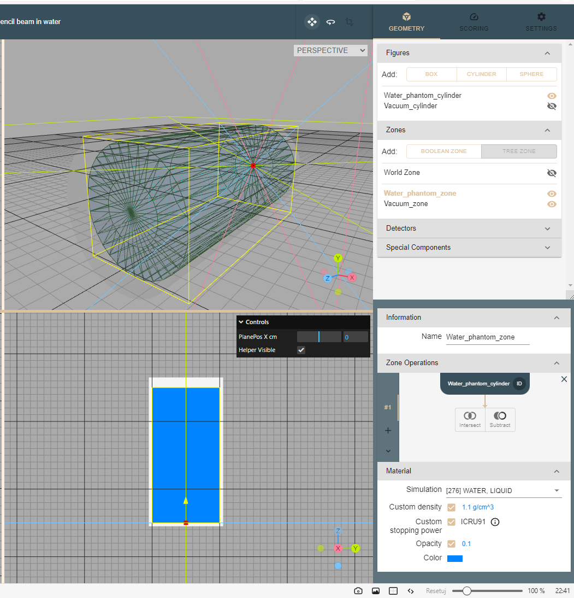
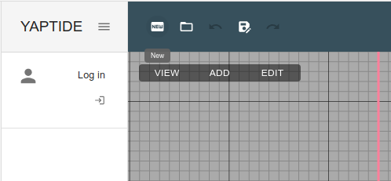
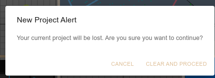
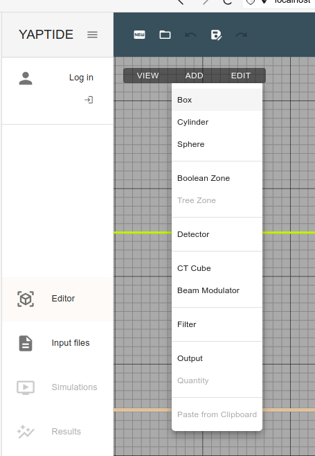
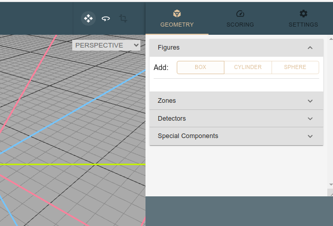
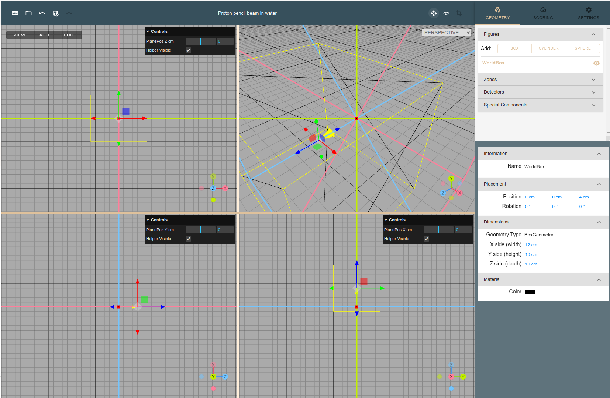
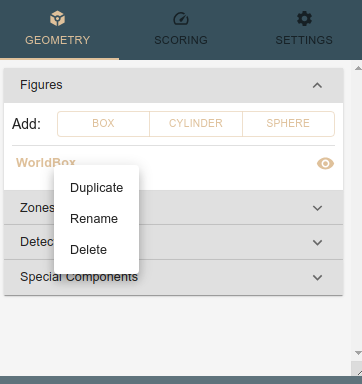
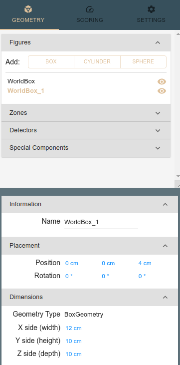
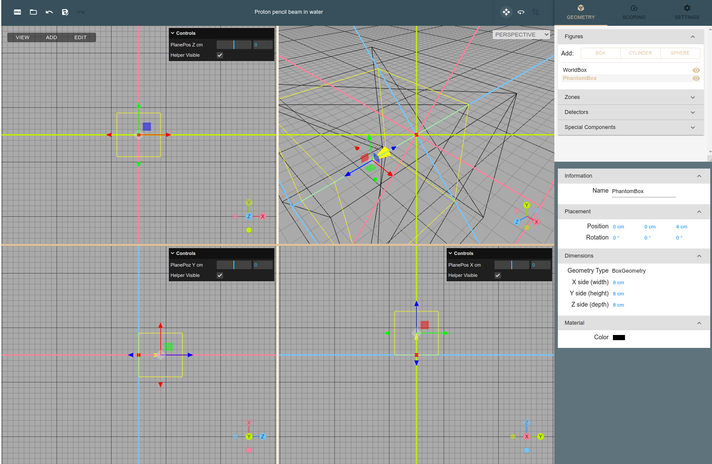
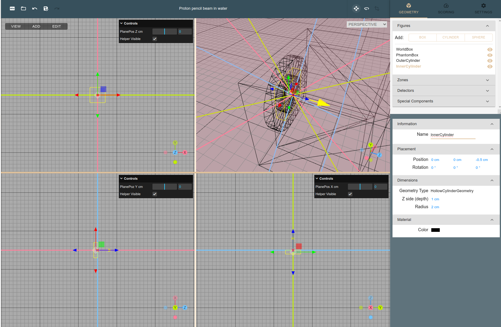

# Geometry

The geometry is composed of the following elements:

  * list of abstract figures (boxes, cylinders, spheres, etc.). The figures are defined by their position and size and has no material assigned to them.
  * list of zones. The zones are defined by the boolean operations on the abstract figures and have assigned material.

An example geometry is shown below:

## Creating new project

Let us go through the process of defining simple simulation geometry.
The starting point would be a modification of existing project or creation of a new one.
Let us start with a new project as this will be good opportunity to introduce most of the Yaptide features.
It can be done using "New" button in the upper left part of the Editor window (select Editor in left menu).

{: style="height:150px"}

You will be prompted that this operation will overwrite the current project. Save your previous work if you want to keep it.

## Adding new figure

### World box

Lets start with adding a box filled with air with dimensions large enough to fit the other object we would like to simulate.
There are two ways to add a box, either from upper left menu in the Editor tab or by going to Geometry tab in right menu and expanding "Figures" block. Both entries are in the "Editor" window.

Lets create a box spanning from -2 to 10 in z direction and from -5 to 5 in x and y direction.
In the yaptide we need to provide box center (named "Position") and its dimensions (named "X/Y/Z side").
In our case the position will be (4,0,0)  and dimensions 12cm x 10cm x 10cm.
Note that basic dimensions units in yaptide are centimeters.
Leta also assign a meaningful name to the created figure.

The figure is created and its cross-sections in YX, XZ and ZY planes visible in the 3 windows in the center of the screen. 
The 3-D projection is visible as well.

### Large phantom 

Then lets proceed with adding a box which will represend a water phantom in which the simulated beam will stop.
This box will be placed inside the world box and will be 8cm x 8cm x 8cm in size.
We are going to place it at (4,0,0) position as well.
The dimensions are given in such way that the water phantom is fully contained in the world box.

This time we will use a different technique of adding a figure: we will duplicate the WorldBox and modify the dimensions.
Such action can be achieved by right click on the WorldBox entry visible in the "Figures" section of the Geometry tab in right menu.

The newly created figure will inherit the name from the duplicated object. An `_1` suffix will be added to the name to keep all the names unique.
All other properties (like position and dimensions) will be copied as well.

Now lets adjust the dimensions of the newly created figure to 8cm x 8cm x 8cm, as the position can stay the same.
Also the name needs an update.
Note that the two figures are visible in the 3-D projection window, while only current one is visible in the cross-sections.

### Collimator

Finally lets add two cylinders represending outer envelope and inner hole inside the collimator.
You can use drag operation by clicking and dragging on the 3-D projection. This would help to adjust the view, so the collimator is visible.

## Adding new zone

