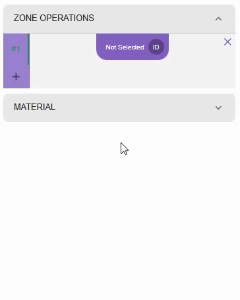
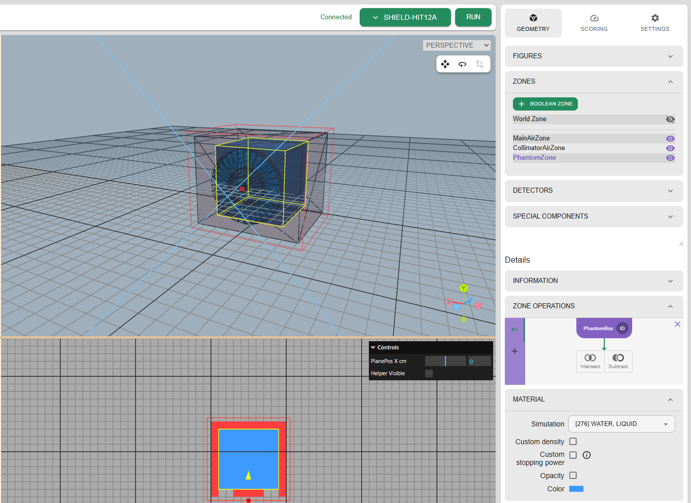
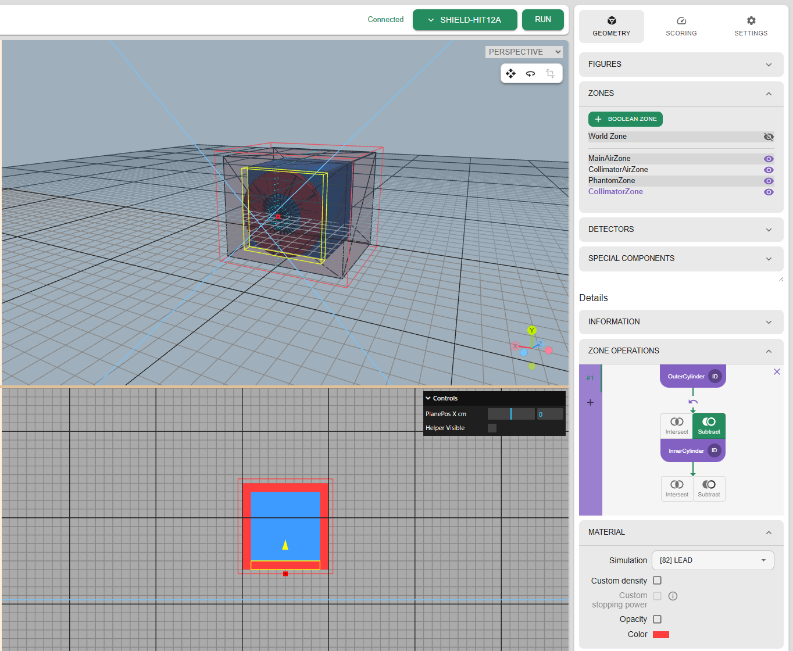

# Defining detector geometry

Geometry definition varies between different types of simulation software. For simulators using Constructive Solid Geometry (CSG), FLUKA and SHIELDHIT-12A,
shapes are defined by set of primitive Figures (boxes, cylinders, spheres) joined together by boolean operators. The order of operators to apply is defined
within a Zone.

For simulators using nested geometry, like Geant4, primitive shapes are defined in a tree-like structure, and all properties are set directly on the Figures.

## Starting a new project

### Blank Project

To start assembling the simulation geometry, you can either create a blank project or use an existing one as a base.

To create a new blank project, click Project > New.

You will be prompted that this operation will overwrite the current project. Save your previous work if you want to keep it.

Next, you will be asked to provide a project title, and, optionally, project description. Click `SAVE` to close the modal and enter the editor.

For blank project, you can select which simulator you want to use by clicking the dropdown in the header bar.

> [!NOTE]
> The COMMON option represents the set of features supported by both FLUKA and SHIELDHIT-12A. You can switch from COMMON
> to either of these simulators.

> [!NOTE]
> You can modify the title and description by clicking the title in the header bar.
>
> 

### Example project

Navigate to Examples page. The available examples are grouped by the simulation software they were created with.
With the exception of COMMON, they will only work with that simulator.

Next, you will get similar Alert as when creating blank project. After confirmation, you are presented with editor page.

The title and description come from the example, you can modify them by clicking the title in header bar.

## Adding figures

In the following sections we will go through generation of simple geometry. It will consist of:

- water phantom box
- lead collimator with 2cm radius hole and 1cm thickness
- world filled with air

### World filled with air

Lets start with adding a box filled with air with dimensions large enough to fit the other object we would like to simulate.
There are two ways to add a box, either selecting `Object > Box` in Menu Bar, or clicking `+ BOX` in FIGURES section in GEOMETRY tab.

Lets create a box spanning from -2 to 10 in z direction and from -5 to 5 in x and y direction.
We do this by providing box center (named "Position") and its dimensions (named "X/Y/Z side").
In our case the position will be (4,0,0)  and dimensions 12cm x 10cm x 10cm.
Note that basic dimensions units in YAPTIDE are centimeters.
Leta also assign a meaningful name to the created figure.

The figure is created and its cross-sections in YX, XZ and ZY planes visible in the 3 windows in the center of the screen. 
The 3-D projection is visible as well.

### Large phantom 

Let's now add a box which will represent a water phantom in which the simulated beam will stop.
This box will be placed inside the world box and will be 8cm x 8cm x 8cm in size.
We are going to place it at (4,0,0) position as well.
The dimensions are given in such way that the water phantom is fully contained in the world box.

This time we're going to demonstrate how to duplicate existing figure, and then modify its dimensions.
Right-click on the WorldBox entry visible in the FIGURES section and click Duplicate.

The newly created figure will inherit the name from the duplicated object. An `_1` suffix will be added to the name to keep all the names unique.
All other properties (like position and dimensions) will be copied as well.

Now lets adjust the dimensions of the newly created figure to 8cm x 8cm x 8cm, as the position can stay the same.
Also the name needs an update to `PhantomBox`.
Note that the two figures are visible in the 3-D projection window, while only current one is visible in the cross-sections.

### Collimator

Finally lets add two cylinders representing outer envelope and inner hole inside the collimator.
The cylinders have thickness of 1cm and are radius of 4 and 2 cm appropriately.
Both are centered around (0,0,0) point.
You can use drag operation by clicking and dragging on the 3-D projection view. This would help to adjust the view, so the collimator is visible.

## Adding new zone

With the figures defined above, we can construct the zones which will be used in the simulation.
Here we follow the naming of SHIELD-HIT12A, as Fluka calls the zones "regions".

Lets start with adding a zone which will represent the large box filled with air.
This can be done in a similar way as adding the figures, either from upper left menu in the Editor tab
or by going to Geometry tab in right menu and expanding ZONES section in GEOMETRY tab.

> [!NOTE] A special "World Zone" which represents the whole simulation environment is defined by default, and can't be removed.

### Main zone

We start by defining first zone from the main box, and setting its name to "MainZone", just like for figures.

Zones describe a volume of space by combining multiple figures using boolean operations to define shape,
and define physical material that the volume is made of.

> [!WARN] Defining a volume operations requires special considerations. Each volume of space should belong to exactly
> one Zone so that it is clear for the simulator which material the particle is going through.
> This means that the volume enclosing another volume with different material needs to have a cutout that will fit the inner volume.

Let's expand ZONE OPERATIONS and define the MainZone.
The MainZone is the Air that fills the empty space around the phantom and the collimator.
We need to subtract both the phantom and the collimator.
- For the phantom, it only requires subtracting the phantom figure
- For the collimator, we need to subtract the whole outer cylinder, and add back the inner cylinder

Zones are visualized in the 3D view by solid colors. We can see the cutouts for the phantom and the collimator.

> [!NOTE] To better see what's inside the zone, you can set the Opacity under MATERIAL section.
> 
> 

### Water phantom zone

We repeat the same thing for water phantom zone. Let's add new zone and assign the "PhantomBox" as the figure.
There is no need to assign the material as we stay with defaul "Liquid Water" material.

Under the MATERIAL section, instead of Opacity, we change the color and inspect the zone in the 3D view.

### Collimator zone

The collimator is a lead ring that is created by subtracting inner cylinder from outer cylinder.
We name the zone appropriately and set the material.

These are the basic steps for defining geometry for CSG-based simulators.