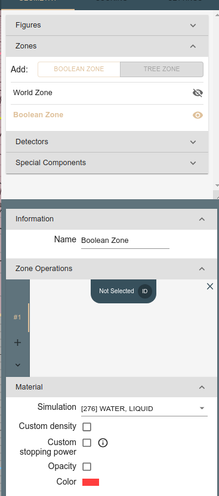
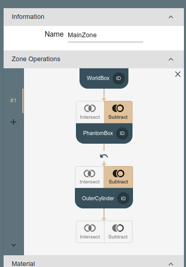
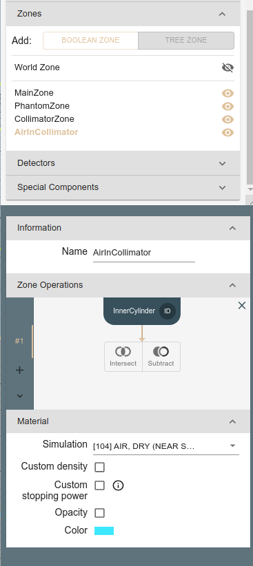

# Geometry

The geometry is composed of the following elements:

  * list of abstract figures (boxes, cylinders, spheres, etc.). The figures are defined by their position and size and has no material assigned to them.
  * list of zones. The zones are defined by the boolean operations on the abstract figures and have assigned material.

An example geometry is shown below:

## Creating new project

Let us go through the process of defining simple simulation geometry.
The starting point would be a modification of existing project or creation of a new one.
Let us start with a new project as this will be good opportunity to introduce most of the Yaptide features.
It can be done using "New" button in the upper left part of the Editor window (select Editor in left menu).

{: style="height:150px"}

You will be prompted that this operation will overwrite the current project. Save your previous work if you want to keep it.

## Adding figures

### Main box

Lets start with adding a box filled with air with dimensions large enough to fit the other object we would like to simulate.
There are two ways to add a box, either from upper left menu in the Editor tab or by going to Geometry tab in right menu and expanding "Figures" block. Both entries are in the "Editor" window.

Lets create a box spanning from -2 to 10 in z direction and from -5 to 5 in x and y direction.
In the yaptide we need to provide box center (named "Position") and its dimensions (named "X/Y/Z side").
In our case the position will be (4,0,0)  and dimensions 12cm x 10cm x 10cm.
Note that basic dimensions units in yaptide are centimeters.
Leta also assign a meaningful name to the created figure.

The figure is created and its cross-sections in YX, XZ and ZY planes visible in the 3 windows in the center of the screen. 
The 3-D projection is visible as well.

### Large phantom 

Then lets proceed with adding a box which will represend a water phantom in which the simulated beam will stop.
This box will be placed inside the world box and will be 8cm x 8cm x 8cm in size.
We are going to place it at (4,0,0) position as well.
The dimensions are given in such way that the water phantom is fully contained in the world box.

This time we will use a different technique of adding a figure: we will duplicate the WorldBox and modify the dimensions.
Such action can be achieved by right click on the WorldBox entry visible in the "Figures" section of the Geometry tab in right menu.

The newly created figure will inherit the name from the duplicated object. An `_1` suffix will be added to the name to keep all the names unique.
All other properties (like position and dimensions) will be copied as well.

Now lets adjust the dimensions of the newly created figure to 8cm x 8cm x 8cm, as the position can stay the same.
Also the name needs an update to `PhantomBox`.
Note that the two figures are visible in the 3-D projection window, while only current one is visible in the cross-sections.

### Collimator

Finally lets add two cylinders represending outer envelope and inner hole inside the collimator.
The cylinders have thickness of 1cm and are radius of 4 and 2 cm appropriately.
Both are centered around (0,0,0) point.
You can use drag operation by clicking and dragging on the 3-D projection view. This would help to adjust the view, so the collimator is visible.

## Adding new zone

With all the basic figures defined we can use then to construct the zones which will be used in the simulation.
Here we follow the naming of SHIELD-HIT12A, as Fluka calls the zones "regions".

Lets start with adding the zone which will represent the large box willed with air.
This can be done in a similar way as adding the figures, either from upper left menu in the Editor tab or by going to Geometry tab in right menu and expanding "Zones" block. Both entries are in the "Editor" window.
Note that by defaul an automatically created "World Zone" is visible.

### Main zone

We start by defining first zone from the main box, assigning it the material: Air.

After creating new Zone we should see a following entry in the right-menu.
New entry appears as well in the list of Zones.
The newly created zone named "Boolean Zone" has liquid water attached as a meterial by default.
Note that in "Zone Operations" we see "Not selected" message. This means that the zone has no figures attached.

Lets attach the correct figure to the zone by clicking on the "Not selected" message and choosing the "WorldBox" figure.

Then lets rename the zone to "MainZone" and assign the material to it.
The material can be selected from the list of materials in the "Simulation" menu ("Material" area).
After selecting the list of materials you can type few letters ("ai" in our case) and list of materials containing the typed letters will be shown.

To improve visual properties we adjust the color and set opacity to 0.05:

### Water phantom zone

Then we proceed with adding the water phantom zone. Lets add new zone and assign the "PhantomBox" as the figure.
We rename the zone to "PhantomZone". There is no need to assign the material as we stay with defaul "Liquid Water" material.

We change the color and inspect the zone in the 3-D projection window.

There is a caveat with defining the zones by boolean operations. Each point in the space needs to belong to exactly one zone.
This ensures that each point has exactly one material assigned to it.
Currently the interior of the phantom box belongs to both zones: "MainZone" and "PhantomZone". Its unclear which material should be assigned to it: air or water.
Therefore we modify the "MainZone" by subtracting the "PhantomBox" from it.
This is done by selecting "MainZone" on list of zones and choosing "Subtract" operations:

Then the "Not selected field" appears

We choose "PhantomBox" figure there:

Finally the zone operations for "MainZone" are updated:

### Collimator zone

The last zone we are going to define is the collimator zone.
We do it in a similar way as the phantom zone, by adding new zone and assigning the "Collimator" figure to it.

The zone is created by attaching `OuterCylinder` figure and subtracting `InnerCylinder` from it.
Finally we select `Lead` material for the zone.

This time again the `MainZone` needs to be updated as the collimator zone is inside it.

and

