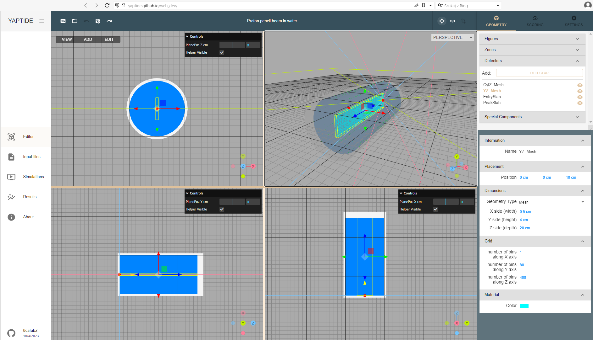
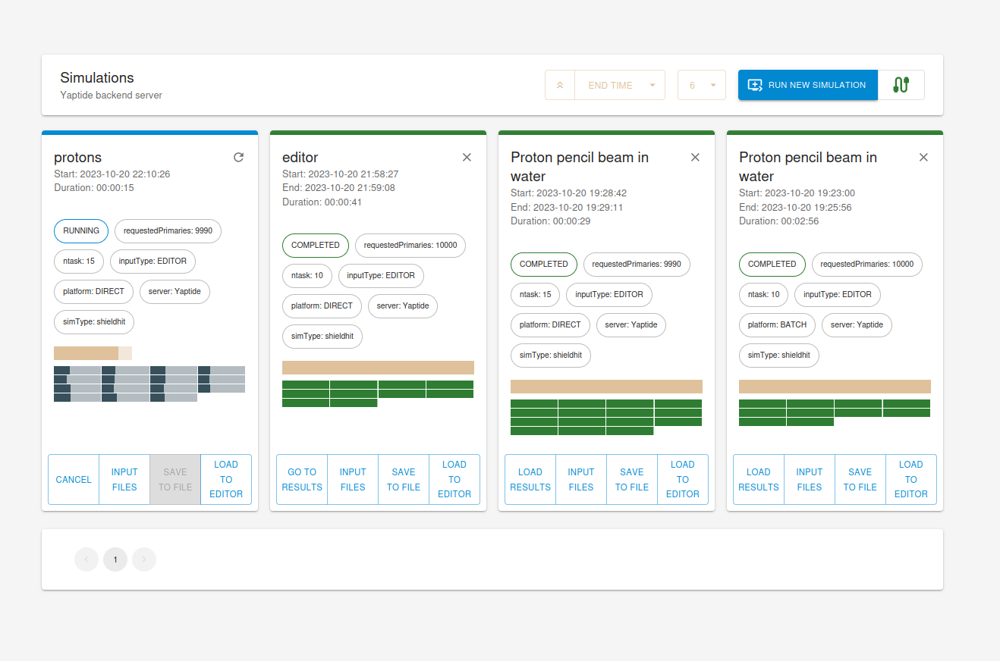
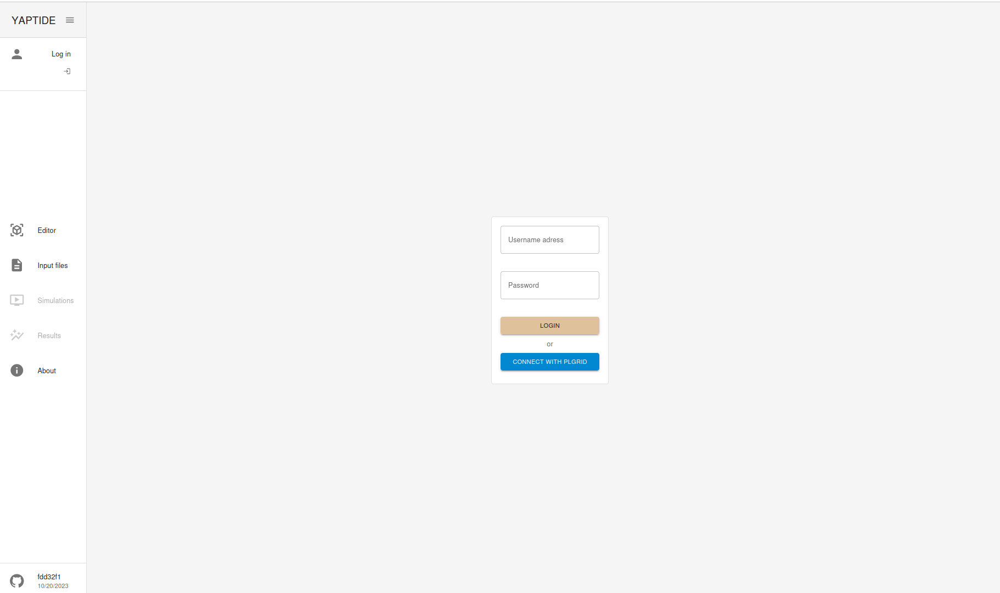

# User documentation

The yaptide platform provides an easy way to work with particle transport simulations.
Most popular particle transport codes, like Geant4, TOPAS, MCNP require preparation of the input text files and running the simulation in a terminal.
The FLUKA code has an graphical user interface, called Flair, but it requires Linux (or Windows with WSL) to run.

The yaptide platform provides a way to define a simulation in a web browser without the need to install any software. This is possible without the need to register or login in the platform.
Having access to the computing resources (i.e. by registering in the PLGRID platform or deploying the platform locally) allows to run the simulation in a parallel way using our web platform. The results of simulation can be visualized in the web browser or downloaded to the local computer.

## How to use the platform

### Demo version

Demo version of the platform is hosted on the GitHub pages as [yaptide.github.io](https://yaptide.github.io).
This version is free for use and doesn't require to register or login.
In demo version the platform works as online editor for simulation input and results browser. Following functionalities are available:

  - defining and visualisation of simulation geometry and materials
  - defining scoring geometry, scored quantities and advanced scoring options (like filtering)
  - defining particle source
  - specifying simulation settings (like physics parameters)
  - generating files with simulation input (to be executed on a user resources)
  - browsing results of simulation (previously calculated using yapide platform or other software)

### Full version

Full version is hosted in the PLGRID infrastructure and requires registration and login. To access the platform visit [yaptide.c3.plgrid.pl](https://yaptide.c3.plgrid.pl).

Full version allows execution of simulation on a cloud (few machines in C3 PLGRID Cloud) or HPC resources (Ares supercomputer in ACK Cyfronet). 

The platform requires registration and allows the access for selected group of users with accound in the PLGRID infrastructure. To register in the platform, please contact the administrator.

