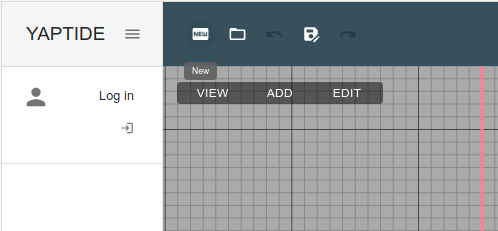

# User documentation

The yaptide platform provides an easy way to work with particle transport simulations.
Most popular particle transport codes, like Geant4, TOPAS, MCNP require preparation of the input text files and running the simulation in a terminal.
The FLUKA code has an graphical user interface, called Flair, but it requires Linux (or Windows with WSL) to run.

The yaptide platform provides a way to define a simulation in a web browser without the need to install any software. This is possible without the need to register or login in the platform.
Having access to the computing resources (i.e. by registering in the PLGRID platform or deploying the platform locally) allows to run the simulation in a parallel way using our web platform. The results of simulation can be visualized in the web browser or downloaded to the local computer.

## How to use the platform

Navigate to the [yaptide platform](https://yaptide.github.io) and start defining your simulation.

