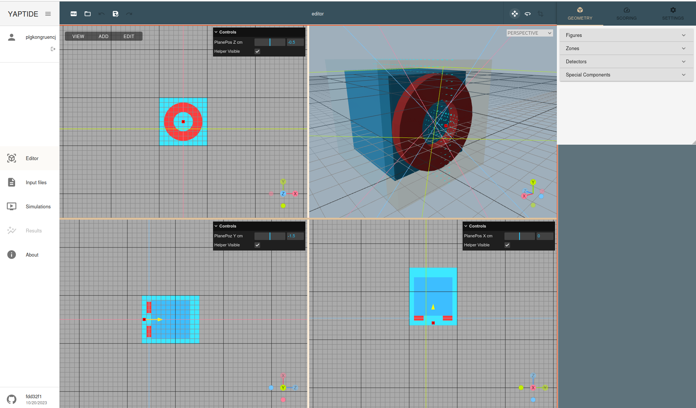
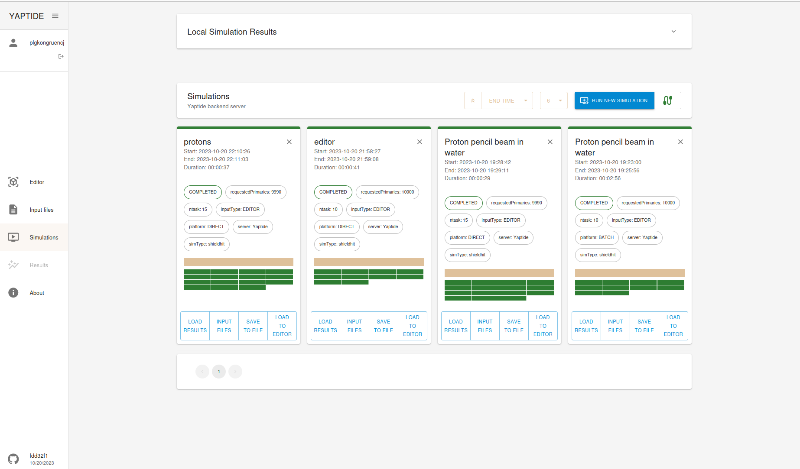
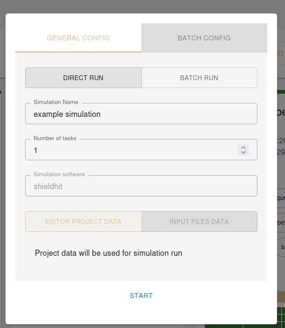
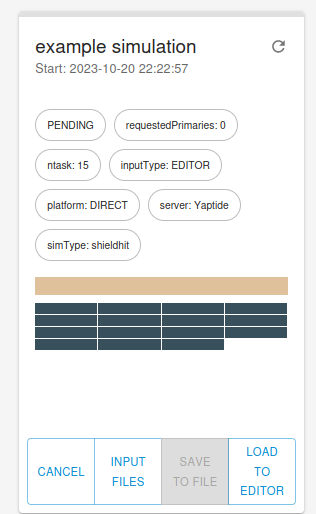
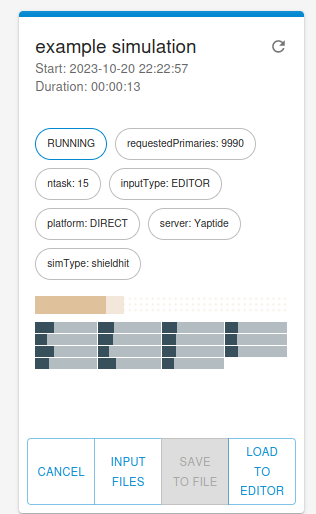
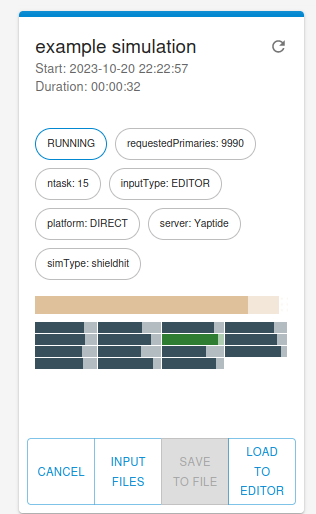

# Running the simulations

## Overview

We assume that you have already registered and logged in to the platform.
To run the simulation you need to have proper project loaded in the editor window. 

To run the simulation please select `Simulation` item in the left menu. You will be presented with list of already completed simulations:

The simulation can be started by clicking on `RUN NEW SIMULATION` button which will present couple of options.

You could choose where to run simulation:

 - as *DIRECT RUN* in the dedicated cloud resources (currently limited to 15 cores machine in the C3 PLGRID Cloud)
 - as *BATCH RUN* in the HPC resources (by submitting the job to the SLURM batch management system in Ares supercomputer)

 The direct run may have much shorter time to start the simulation, but the parallelism is limited to 15 cores. The batch run may take longer to start the simulation, but the parallelism is limited only by the resources available in the HPC cluster.

## Direct run

### Submission 
Lets start by submitting the simulation with 15 cores, selecting proper number of tasks and `DIRECT RUN` option. Press start to submit the simulation.

You will see a new entry in the list of simulations with status `PENDING`. The simulation will start automatically when the resources will be available.

Once the simulation is running, the status will change to `RUNNING` and you will be able to see the progress of the simulation by observing the progress bar of each task.

You can see that some of the tasks may be already completed (green), while others are running (dark).

### Viewing results

Once all tasks are completed, the status of the simulation will change to `COMPLETED` and you will be able to see the results of the simulation.
You will be automatically redirected to the `Results` tab in the left menu.
First you will see a depth dose profile for the `AlongBeamAxis` scoring geometry.

The plots are interactive, using mouse coursor you can zoom selected fragments of the plot:

Both axis scale can be changed to logarithmic by right click in the axis area:

To revert the view you can click in the plot area and disable the logarithmic scale and zooming:

Plots data can be saved to CSV file by clicking on the `Export graph to CSV` button:

The YZ profile can be seen by selecting proper Output item. As we see collimator is stopping most of the protons on radius larger than 2 cm.

Two dimensional plots can be also inspected by plotting the profiles. On right click in the blue colored are we see proper menu:

X projection reveals that with 10^4 primaries statitics is not enough:

## Batch run

When executing simulation with 10^4 primaries and 15 cores, the process completed in 37 seconds. To obtain better statistics we will try to run 10^6 primaries on 100 parallel tasks. This is not possible with direct run, so we will use batch run.

The jobs may stay longer in `PENDING` state, waiting for the resources to be available.

once the simulation is running, the status will change to `RUNNING` and you will be able to see the progress of the simulation by observing the progress bar of each task.
The estimated time of each tasks may be seen by moving mouse cursor over the progress bar.

