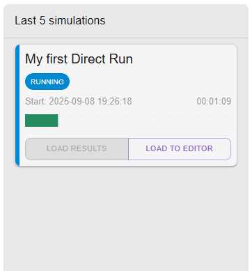

# Running the simulations

## Overview

We assume that you have already registered and logged in to the platform.
To run the simulation you need to have proper project loaded in the editor window. 

To run the simulation, click `RUN` in the title bar, or select Simulation page from the Navigation Bar on the left.

## Simulations Page

The Simulations Page consists of 3 main sections:

1. Simulations Archive, where all previously run simulations are presented in paginated view
2. Run new simulation form which presents different ways to run the simulation currently loaded to Editor
3. Last 5 simulations, which always displays the 5 most recent simulations

> [!NOTE]
> For convenience, the sidebar with sections 2. and 3. is pinned to Simulations, Input files, and Results pages.
> You can run and see recent simulations from each of these pages.

## Running the simulation

You could choose where to run simulation:

 - as *DIRECT RUN* in the dedicated cloud resources (currently limited to 15-core machine in the C3 PLGrid Cloud)
 - as *BATCH RUN* in the HPC resources (by submitting the job to the SLURM batch management system in Ares supercomputer)

 The direct run may have much shorter time to start the simulation, but the parallelism is limited to 15 cores.
 The batch run may take longer to start the simulation, but the parallelism is limited only by the resources available in the HPC cluster.

## Direct run

Direct run is the default option. In the form, you can change the name (doesn't need to be the same as the project title),
number of tasks, and overwrite the number of primary particles (the default is specified under SETTINGS in Editor page).

When the parameters are set, click `START SIMULATION` to send it to the YAPTIDE server.
After successful submission, the simulation is in PENDING state.
The simulation will start automatically when the resources will be available, then it will change to RUNNING state,
and you will be able to see the progress of the simulation by observing the progress bar.

The simulation is also present in the pinned "Last 5 simulations" section.

When the simulation finishes, it will automatically navigate to Results page and display the results.

### Viewing results

Once all tasks are completed, the status of the simulation will change to `COMPLETED` and you will be able to see the results of the simulation.
You will be automatically redirected to the `Results` tab in the left menu.
First you will see a depth dose profile for the `AlongBeamAxis` scoring geometry.

The plots are interactive, using mouse cursor you can zoom selected fragments of the plot:

To revert the view you can click in the plot area and disable the logarithmic scale and zooming.
Both axes scale can be changed to logarithmic by right click in the axis area.

Plots data can be saved to CSV file by clicking on the `Export graph to CSV` button:

The YZ profile can be seen by selecting proper Output item. As we see collimator is stopping most of the protons on radius larger than 2 cm.

Two-dimensional plots can be also inspected by plotting the profiles. On right click in the blue colored area we see proper menu:

## Batch run

If the plots need more precision, then we need to rerun the simulation with more primaries. We can quickly reach the Run new simulation form
and increase the number. This will make the simulation run take much more time. For the case of computationally expensive simulations,
we can utilize the Batch Run.

The job pops up in the queue, and we can use the application in the meantime.

> [!NOTE]
> Large Batch Jobs may stay longer in `PENDING` state, waiting for the resources to be available.