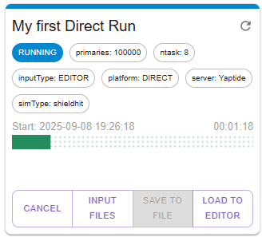

# Running the simulations

## Overview

!!! info
    This part of the application may not be available in Demo Mode. If you are working with SHIELD-HIT12A or FLUKA,
    you need to be logged in to the platform. We assume that you have already registered and logged in, if required to do so.
    For Geant4, no additional steps are required.

To run the simulation you need to have a project loaded in the editor window. 

To run the simulation, click `RUN` in the title bar, or select Simulation page from the Navigation Bar on the left.

## Simulations Page

The Simulations Page consists of 3 main sections:

1. Simulations Archive, where all previously run simulations are presented in paginated view
2. Run new simulation form which presents different ways to run the simulation currently loaded to Editor
3. Last 5 simulations, which always displays the 5 most recent simulations

!!! note
    For convenience, the sidebar with sections 2. and 3. is pinned to Simulations, Input files, and Results pages.
    You can run and see recent simulations from each of these pages.

## Running the simulation

=== "SHIELD-HIT12A / FLUKA"

    You may choose how to run the simulation:

    - as *DIRECT RUN* in the dedicated cloud resources (currently limited to 15-core machine in the C3 PLGrid Cloud)
    - as *BATCH RUN* in the HPC resources (by submitting the job to the SLURM batch management system in Ares supercomputer)

    The direct run will take less time to start the simulation, but the parallelism is limited to 15 cores.
    The batch run will take longer to start the simulation, but the parallelism is limited only by the resources available in the HPC cluster.

    ## Direct run

    Direct run is the default option. In the form, you can change the name (doesn't need to be the same as the project title),
    number of tasks, and overwrite the number of primary particles (the default is specified under SETTINGS in Editor page).

    

    ## Batch run

    If the plots need more precision, then we need to rerun the simulation with more primaries. We can quickly reach the Run new simulation form
    and increase the number. This will make the simulation run take much more time. For the case of computationally expensive simulations,
    we can utilize the Batch Run.

    

    The job pops up in the queue, and we can use the application in the meantime.

    

    !!! note
        Large Batch Jobs may stay longer in `PENDING` state, waiting for the resources to be available.

=== "Geant4"

    In order to run the simulation, Geant4 needs to sample information from datasets.
    You can choose to download them all (`FULL DATASETS`) before starting the simulation
    (you will not be able to start the simulation before the datasets are loaded),
    or to download the necessary files on demand (`PARTIAL DATASETS`).

    

    !!! note
        Using `FULL DATASETS` is a recommended way. After download, the files are stored in the browser even after closing the page
        and can be loaded back nearly instantly.

    For dataset management there exist an additional Dataset Download panel. If the files have not been downloaded yet,
    the `START DOWNLOAD` button is presented. If the application detects that the datasets are present in the browser cache,
    the `LOAD FROM CACHE` button is shown instead.

    

    

    After loading the datasets, you are clear to start the simulation.

When the conditions are met, and the parameters are configured, click `START SIMULATION`.
After successful submission to local or remote worker, the simulation is in PENDING state.
The simulation will start automatically when the resources are available, then it will change to RUNNING state,
and you will be able to see the progress of the simulation by observing the progress bar.

The simulation is also present in the pinned "Last 5 simulations" section.

When the simulation finishes, it will automatically navigate to Results page and display the results.

### Running from input files

The default source for the simulation data is the active editor project. Under the hood, the project is converted into
input files that the specific simulator understands. You may want to modify the files directly, and start the simulation
with the modified input.

Navigate to Input Files panel, select `GENERATE FROM EDITOR` to get the files that would be submitted.
You can modify them to your needs. When you are ready, click `RUN WITH THESE INPUT FILES`. You will see the Run form
switches from `EDITOR PROJECT DATA` to `INPUT FILES DATA` and the files are listed. Click `START SIMULATION` to start
with the modified files.

### Viewing results

Once all tasks are completed, the status of the simulation will change to `COMPLETED` and you will be able to see the results of the simulation.
You will be automatically redirected to the `Results` tab in the left menu.
First you will see a depth dose profile for the `AlongBeamAxis` scoring geometry.

The plots are interactive, using mouse cursor you can zoom selected fragments of the plot:

To revert the view you can click in the plot area and disable the logarithmic scale and zooming.
Both axes scale can be changed to logarithmic by right click in the axis area.

Plots data can be saved to CSV file by clicking on the `Export graph to CSV` button:

The YZ profile can be seen by selecting proper Output item. As we see collimator is stopping most of the protons on radius larger than 2 cm.

Two-dimensional plots can be also inspected by plotting the profiles. On right click in the blue colored area we see proper menu:

