# Scoring

Scoring requires user to define several items:

  * Scoring geometry, here named "detector"
  * Scoring quantity
  * Scoring output, which is a group of quantities scored in the same detectors

In addition, there are several optional items:

  * Scoring filter, which can be attached to selected quantities, i.e. "score the quantities for protons only"
  * Differential modifiers, i.e. allowing to score quantities in different energy bins
  * Other settings, rescaling factors or custom material definitions

In the section below we will add a couple of items to demonstrate the scoring capabilities of YAPTIDE.

## Detectors

Detectors can be added either by selecting `Object > Detector` in Menu Bar or clicking `+ DETECTOR` in DETECTORS section in GEOMETRY tab.

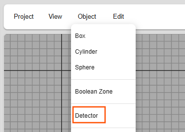

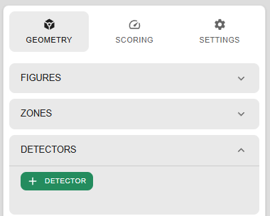

### Narrow cylinder along the beam axis

Let's start with adding a cylinder with radius of 1cm and length of 12cm along the beam axis, spanning from -2cm to 12cm along Z axis.
By pressing `+ DETECTOR` button a new item will be added to the list of detectors. Change the settings as follows:

- Rename the detector to `AlongBeamAxis`.
- Set the position in PLACEMENT section. To get correct span we set center to (0,0,4) cm.
- Select the geometry type. For this example, use Cyl for cylinder geometry. Change the depth and radius as below.
- Under GRID, change the number of bins. We divide the detector into 120 bins along the Z axis, so that each bin is 1mm long.

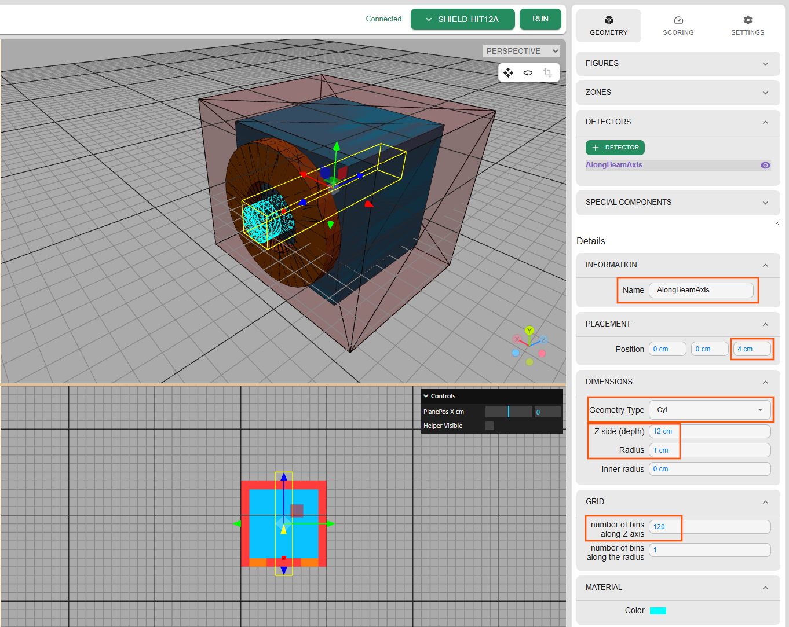

When selected, the detector should be visible in the 3D and cross-section views.

### Slab in YZ plane

Lets add a 1mm thick slab detector in YZ plane, spanning from -2cm to 12cm in Z direction and -5cm to 5cm in Y direction.

We select the detector type to be `Mesh` and set the center to (0,0,4) cm and dimensions to 0.1 x 10 x 12 cm.
This time the bins are defined in Y and Z directions, so we set 100 bins in Y and 120 bins in Z directions to get 1x1mm bins.

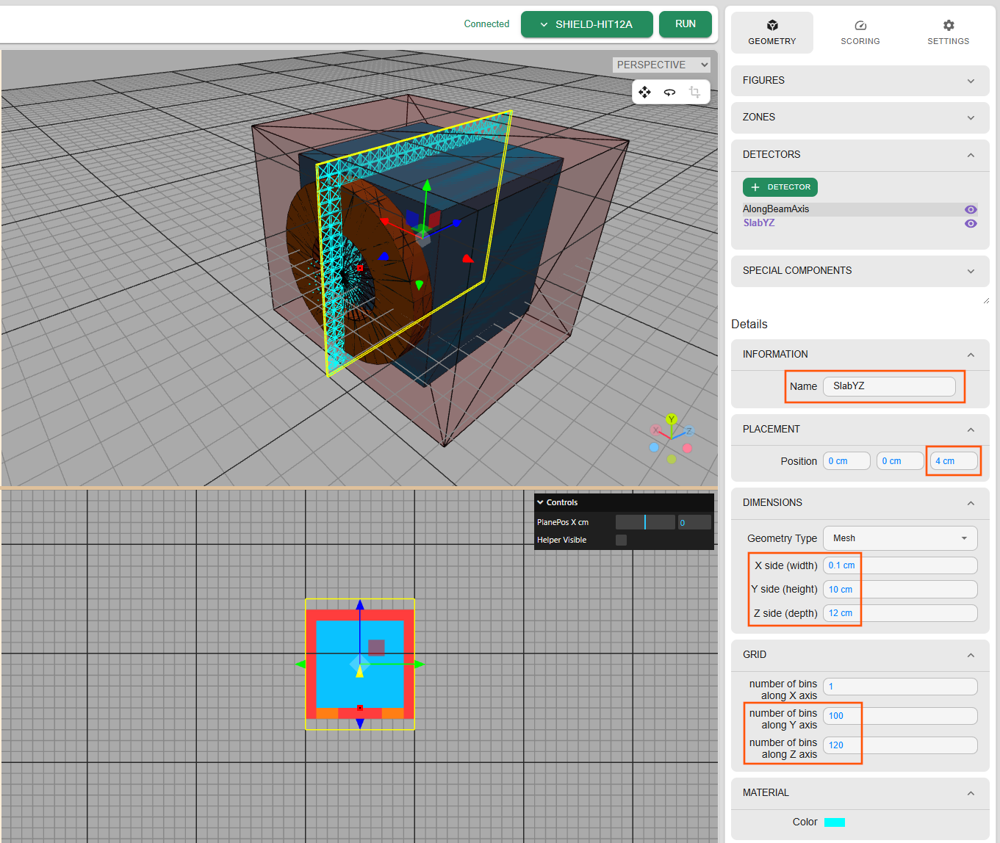

## Scoring output

To define scoring output we switch to SCORING tab in the right menu of Editor view.

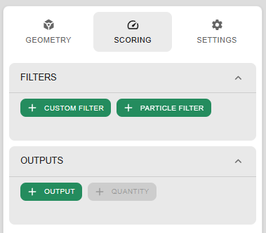

### Along the beam axis

To define new scoring output we press "Add output" button in the Outputs area. A new item will be added to the list of outputs.
This item will have no detector assigned.

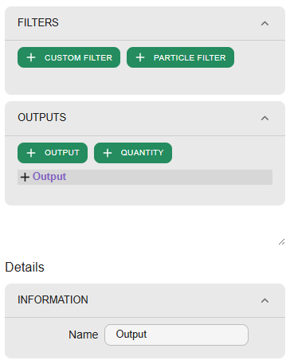

Let's assign the output an appropriate name `AlongBeamAxis` and select the detector from the dropdown list.
The chosen detector will be visible in the 3D and cross-section views.

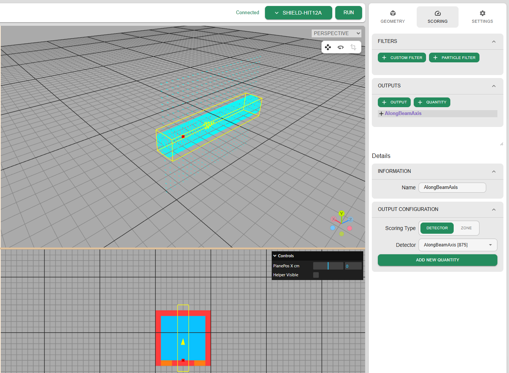

### YZ plane slab

We repeat the steps for the slab detector.

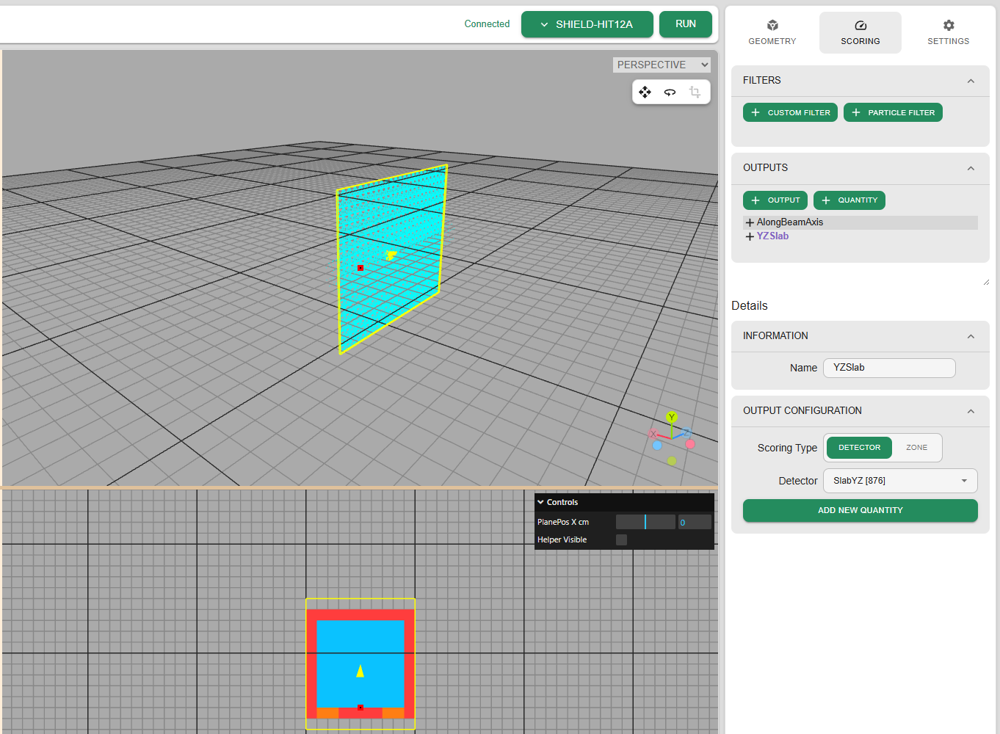

## Scoring quantity

### Depth dose profile

Let's start by defining a scoring for depth dose profile in cylinder detector along the beam axis.
This can be done by expanding the `AlongBeamAxis` item in the Outputs list by clicking on `+` icon.
We can see that the output has already a first scoring quantity added, named `Quantity`.

=== "SHIELD-HIT12A"

    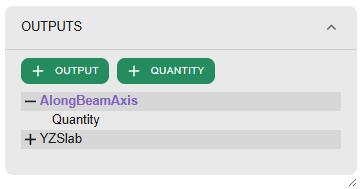

    By default, scoring of dose was selected, so we stay with this, just adding a meaningful name: `Dose`.

    We are planning to simulate the interaction of beam of protons with the phantom, and with such scoring we could see the
    characteristic Bragg peak.

=== "🚧 FLUKA"

    Under development

=== "🚧 Geant4"

    Under development

### Fluence profile in YZ plane

Since in our geometry we applied a 1 cm thick collimator made of lead, we would like to see the effect of the collimator
on the fluence of protons. Such thickness should be enough to stop most completely 70 MeV protons
(the CSDA range in lead at that kinetic energy is about 8mm).

=== "SHIELD-HIT12A"

    To score the fluence, we need to change the scoring quantity to `Fluence` and add a meaningful name.
    We select default quantity in `YZSlab` item, define proper name and quantity type:

    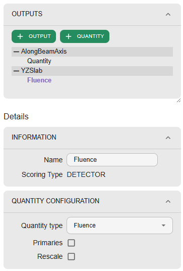

=== "🚧 FLUKA"

    Under development

=== "🚧 Geant4"

    Under development

!!! note
    Quantity type supports typing letters to filter the list of available quantities.

Often, scoring a quantity for all passing particles won't be very useful.
In this case, to limit the scoring to protons only, we need to add a filter.

#### Scoring filter

=== "SHIELD-HIT12A"

    We define a filter in the FILTERS section of the SCORING tab.
    By pressing `+ FILTER` (or `+ CUSTOM FILTER` in SHIELD-HIT), new filter will be added to the list of filters.
    We adjust the name of the filter to `Protons` and add two rules to define proton (A=1 and Z=1):
    First rule is added by clicking `ADD RULE` button and then selecting `Z` and `=` from the drop-down lists.
    Then we type `1` in the text field.

    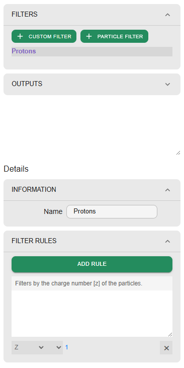

    Second rule defines the `A=1` condition.

    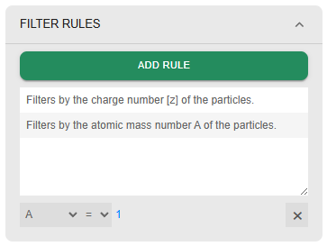

    Finally, we apply the filter by selecting the Filter checkbox in the `Fluence` item in the list of `YZSlab` quantities.
    Then we choose `Protons` from the drop-down list of filters.

    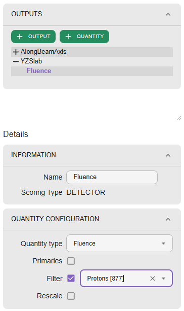

    !!! note
        For SHIELD-HIT12A specifically, you can use `+ PARTICLE FILTER` and select Protons to get the same filter effect.

=== "🚧 FLUKA"

    Under development

=== "🚧 Geant4"

    Under development
