# Scoring

Scoring requires user to define several items:

  * Scoring geometry, here named as detector
  * Scoring quantity
  * Scoring output, which is a group of quantities scored in the same detectors

In addition, there are several optional items:

  * Scoring filter, which can be attached to some quantities, like score the quantities for protons only
  * Differential modifiers, i.e. allowing to score quantities in different energy bins
  * Other settings, rescaling factors or custom material definitions    

In the section below we will add couple of items to demontrate the scoring capabilities of Yaptide.

## Detectors

Detectors can be added from `Detector` area in the right menu of Editor view.

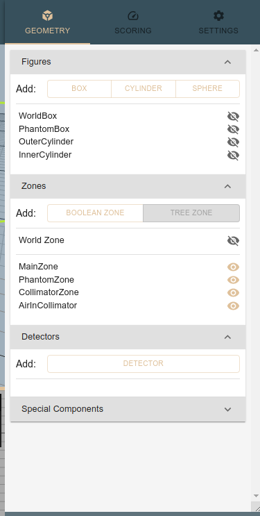

another option is the menu in upper left corner of the Editor view:

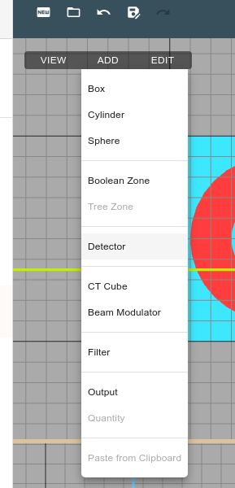

### Narrow cylinder along the beam axis

Lets start with adding a cylinder with radius of 1cm and length of 12cm along the beam axis, spanning from -2cm to 12cm along Z axis.
By pressing "Add detector" button a new item will be added to the list of detectors.

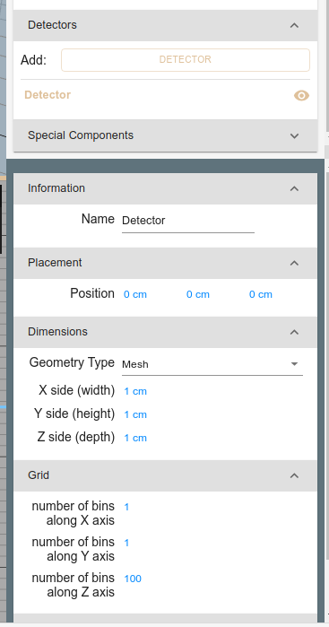

We follow by assigning a name to the detector: `AlongBeamAxis`.
Then we change the detector type to `Cyl`:

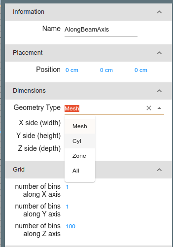

Finally we can adjust the size and position of the detector. To get correct span we set center to (0,0,4) cm.
We also divide the detector into 120 bins along the Z axis, so that each bin is 1mm long.

When selected the detector should be visible in the 3D and cross-section views.

### Slab in YZ plane

Lets add a 1mm thick slab detector in YZ plane, spanning from -2cm to 12cm in Z direction and -5cm to 5cm in Y direction.

We select the detector type to be `Mesh` and set the center to (0,0,4) cm and dimensions to 0.1 x 10 x 12 cm.
This time the bins are defined in Y and Z directions, so we set 100 bins in Y and 120 bins in Z directions to get 1x1mm bins.

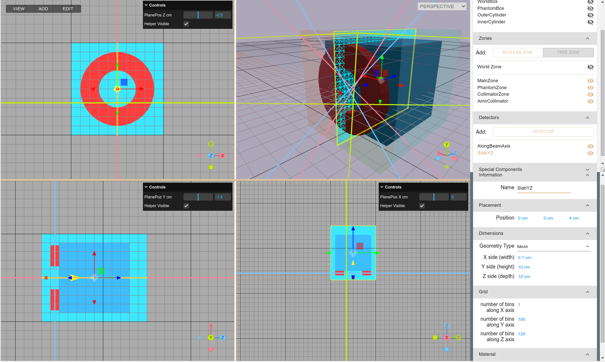

## Scoring output

To define scoring output we switch to `Scoring` tab i the right menu of Editor view.

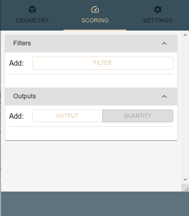

### Along the beam axis

To define new scoring output we press "Add output" button in the Outputs area. A new item will be added to the list of outputs.
This item will have no detector assigned.

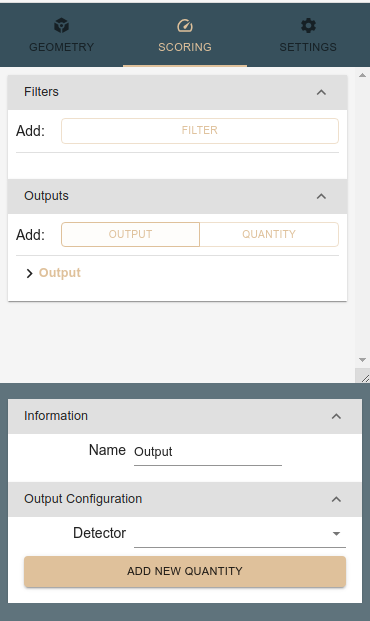

First we select proper detetor from a drop-down list:

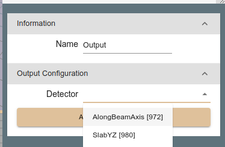

Then we assign a proper name to the output: `AlongBeamAxis`. We may use the same name as the name of the detector, but it is not required.
The choosen detector will be visible in the 3D and cross-section views:

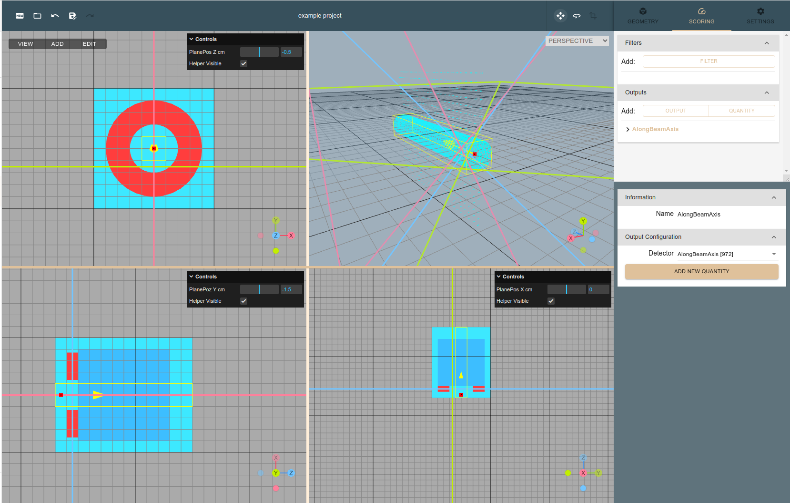

### YZ plane slab

We repeat similar exercise to define the output for the slab detector.

## Scoring quantity

### Depth dose profile

Lets start by defining a scoring for depth dose profile in cylinder detector along the beam axis.
This can be done by expanding the `AlongBeamAxis` item in the Outputs list by clicking on `>` icon.
We can see that the output has already a first scoring quantity added, named `Quantity`.

By default scoring of dose was selected, so we stay with this, just adding a meaningful name.

We are planning to simulate the interaction of beam of protons with the phantom, therefore with such scoring we could see the characteristic Bragg peak.

### Fluence profile in YZ plane

As in our geometry we applied a 1 cm thick collimator made of lead, we would like to see the effect of the collimator on the fluence of protons.
Such thickness should be enough to stop most completely 70 MeV protons (the CSDA range in lead at that kinetic energy is about 8mm).

To score the fluence we need to change the scoring quantity to `Fluence` and add a meaningful name.
We select default quantity in `YZSlab` item, define proper name and quantity type:

Note that we can type some letters to get list of available quantities filtered by the typed letters.

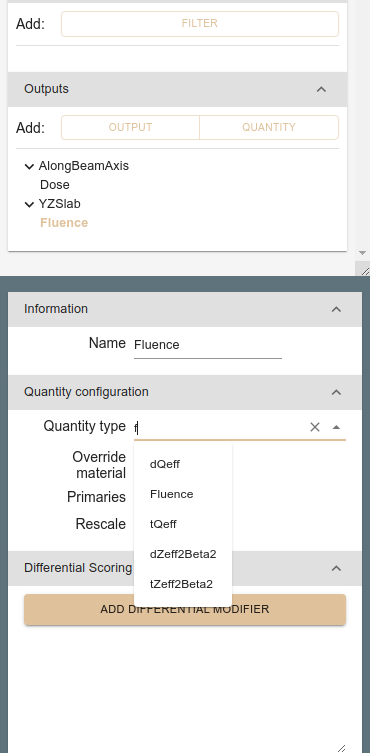

Such quantity won't be very useful, as it will show the fluence of all particles, including neutrons and other charged particles.
To limit the scoring to protons only we need to add a filter.

#### Scoring filter

We define a filter in the "Filters" area of the Scoring tab.
By pressing `Add Filter` new item will be added to the list of filters.

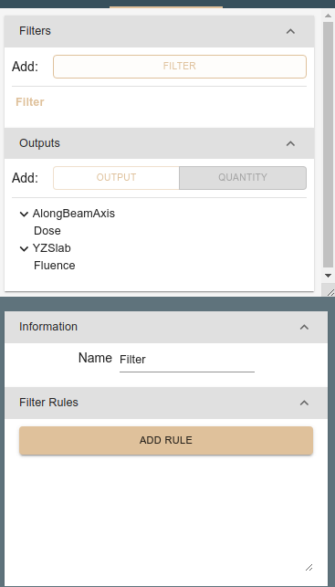

We adjust the name of the filter to `Protons` and add two rules to define proton (A=1 and Z=1):
First rule is added by clicking on `Add Rule` button and then selecting `Z` and `=` from the drop-down lists.
Then we type `1` in the text field.

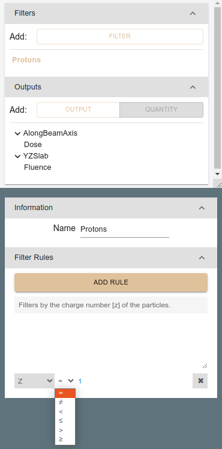

Second rule defines the `A=1` condition.

Finally we apply the filter by selecting the Filter checkbox in the `Fluence` item in the list of `YZSlab` quantities.
Then we choose `Protons` from the drop-down list of filters.

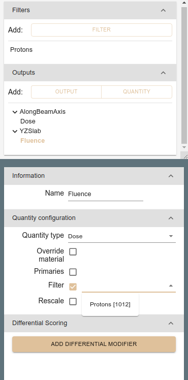