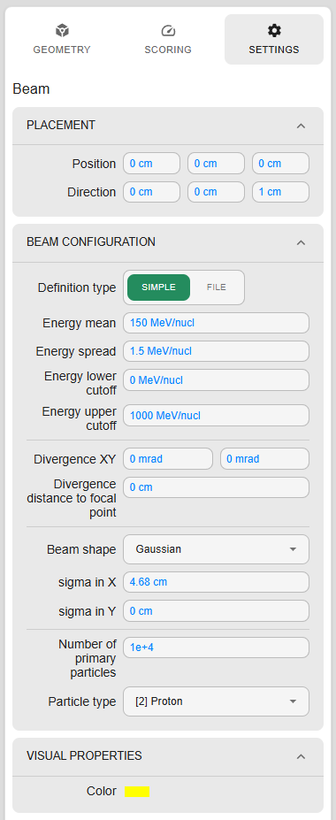
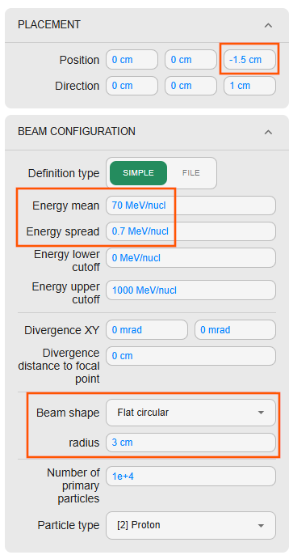
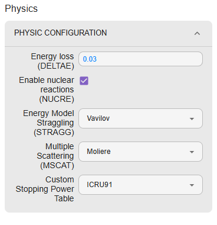

# Particle source

Particle source is defined in the `Settings` tab in the right menu of Editor view:

User can define the place of the source, its direction and energy. Also, the beam divergence and shape can be defined.
Finally, particle type and number of primaries can be set.

=== "SHIELD-HIT12A"

    In our case we will move the beam to be located in front of the collimator by setting the beam position to (0,0,-1.5) cm.
    The energy is adjusted to 70 MeV with 1% of energy spread, this way we can stop the beam using 1cm of lead.
    Beam shape is set to a circular shape with 3cm radius (to be larger than the collimator hole).

    

    Rest of parameters are left with default values.

=== "🚧 FLUKA"

    Under development

=== "Geant4"

    In our case we will move the beam to be located in front of the collimator by setting the beam position to (0,0,-6) cm.
    The energy is adjusted to 70 MeV with 1% of energy spread, this way we can stop the beam using 1cm of lead.
    Beam shape is set to a circular shape with 3cm radius (to be larger than the collimator hole).

    

    Rest of parameters are left with default values.

# Physics settings

Physics settings are defined in the `Physics` area just below the `Beam` definition.

=== "SHIELD-HIT12A"

    User is allowed to tune the step length via relative energy loss parameter (decreasing it will reduce the step size).
    Also nuclear reactions can be turned on or off and scattering models can be selected.

    

=== "Geant4"

    Currently unsupported
